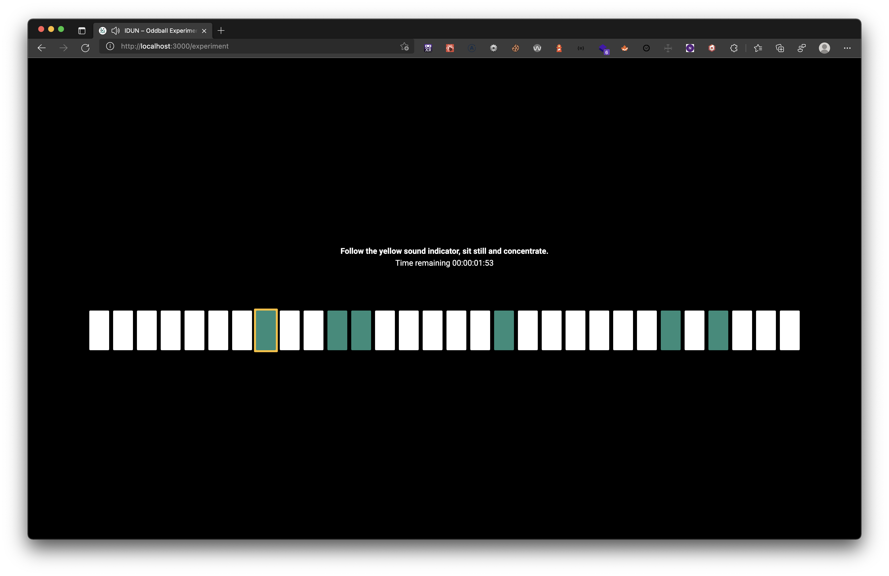

# Problem 1: Frontend and UX

## 🎯 Problem

Neuroimaging studies are typically small in sample size. Having a system like the IDUN Guardian EEG device would enable us to acquire data from a large population cohort. There are efforts in trying to find EEG markers that are sufficiently robust for real-world measurements. Established paradigms such as the alpha induction experiment or auditory steady state response (ASSR) have shown to be robust. Moreover, there is an interest in other validated tasks such as the so-called auditory oddball paradigm. Specifically, in the auditory oddball paradigm the user is exposed to a stream of repetitive tones (of the same frequency) where once in a while a different tone appears (in other words the oddball which has a different frequency than the sequence of repetitive tones). Interestingly, the brain reacts unconsciously to the oddball after adapting to the tone sequence even when focusing on something else (e.g., for example focusing the gaze towards a cross centered on the screen).

### The design of the experiment might look like this

- Total duration of experiment: 2 minutes
- Two tones with different frequencies (e.g., 200 Hz and 500 Hz) and tone duration: 60 ms
- The appearance of the oddballs happens at random time points

## ✅ Tasks

- [x] Sketch the experiment graphically
- [x] Design and implement the experimental task in a webApp using any frontend web development frameworks, the experiment starts with a button press and ends after 2 minutes with the screen text “Experiment complete”
- [x] What do you think is important for designing an experiment when you care about excellent signal quality? (1 or 2 sentences)

### Question and answer

**Q:** What do you think is important for designing an experiment when you care about excellent signal quality?

**A:** I think it is important that the experiment is well explained with clear and precise instructions beforehand. The signal should preferably not contain noise from other stimuli, so I value a simple user interface without distracting elements and full-screen functionality during the experiment. From a technical point of view, I would say that it is essential that no computationally intensive tasks are performed on the client-side, as the server is the only place where the data is processed with the guarantee that it will be computed in the same way every time.

## 🚀 Guides

### Run the build server

- Build the Docker image with `docker build . -t idun-frontend:latest`.
- Run the created image with `docker run -p 8080:8080 idun-frontend`.
- Access the site on <http://localhost:8080>.

### Run the development server

- Install all dependencies with `yarn`.
- Start the hot-reload NextJS development server with `yarn dev`.
- Access the site on <http://localhost:3000>.
