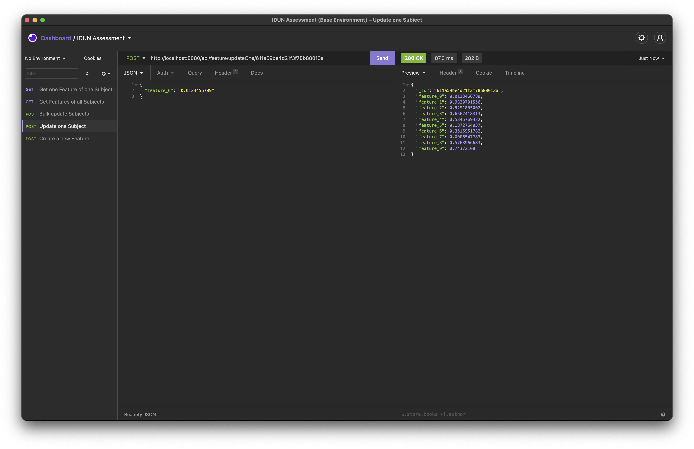

# Problem 2: Backend and Cloud

## 🎯 Problem

Now, the data that was recorded from an experiment should be transformed such that the customer/user is able to integrate them with their products. For example, one could change the volume of the TV based on your focus level measured from brain activity. For this, we would like to develop an API for the customer for her/him to access specific data. Attached you will find a file `data.json` which includes (artificial) data from subjects (or users) with a set of features (e.g., from brain signals).

## ✅ Tasks

- [x] Store the JSON file in a data storage and motivate your choice of technologies
- [x] Implement a REST/GraphQL API (any language) in order to enable CRUD operations and test functionality:
  - [x] List feature 2 for all subjects
  - [x] Get feature 1 for subject 52
  - [x] Edit all features for subjects 11 to 1
- [x] Demonstrate the usage of HTTP responses with codes: 200, 404, 500
- [x] Describe the steps on how you want to deploy your application
- [x] What do you consider relevant factors for the design of a scalable API design? (1 or 2 sentences)

### Questions and answers

**Q:** Describe the steps on how you want to deploy your application[?]

**A:** So far, everything is simply containerised via Docker, so it can all be deployed to any cloud computing provider that supports Docker image deployment. I prefer to deploy it on Google Cloud Platform Cloud Run, as that's where I've had the smoothest experience. The MongoDB database is currently just a free sandbox tier; I would turn it into a production-ready tier on GCP to connect the two services easily. Currently, it is also possible to access the database from any IP address; I would need to change that to a more secure way with limited access. The most simple form of deployment that I would utilise at this moment with this scope would be a CI/CD workflow with automated unit and E2E tests via GitHub Actions. If the pipelines pass, the Docker images will get deployed to a Google Container Registry.

---

**Q:** What do you consider relevant factors for the design of a scalable API design?

**A:** If I had more time for this task, I would prefer GraphQL over a REST API due to many factors (mainly DX; TypeDoc/automated documentation, schema fetching, code generation, etc.). In addition, I would say that one of the most important factors is that I would use a microservice architecture because I want to be able to scale easily (in terms of cloud computing and tech stacks): all services are federated in a single GraphQL endpoint, and the whole backend is stateless and managed via Terraform (Infrastructure as Code).

## 🚀 Guides

### Run the build server

- Build the Docker image with `docker build . -t idun-backend:latest`.
- Run the created image with `docker run -p 8080:8080 idun-backend`.
- Access the site on <http://localhost:8080>.

### Run the development server

- Install all dependencies with `yarn`.
- Compile the TypeScript code with `yarn build`.
- Start the hot-reload development server with `yarn dev`.
- Access the API endpoint on <http://localhost:8080/api>.
- Import the `insomnia.yaml` file to [Insomnia](https://insomnia.rest) to use the API.

## 🔗 Resources

- [Insomnia GUI API Client](https://insomnia.rest)
- [Insomnia Config File](insomnia.yaml)
- [.env Template File](.env.template)

## 🧩 Remarks

- Be sure that the `problem_2` directory has a `.env` file with the following variables: `PORT` and `DB_URI`. If you don't provide these environment variables, the `Dockerfile` and the compilation process won't work.
- If you compile the backend with `yarn build`, you will get a `/dist` folder with the compiled code and a `/logs` folder with the logs.
- There are some edge cases where the API doesn't work as expected. So far I've implemented the most critical features for a working example REST API.
- For a small documentation, I recommend downloading Insomnia and importing the `insomnia.yaml` file. It gives you a good overview of all the endpoints.
