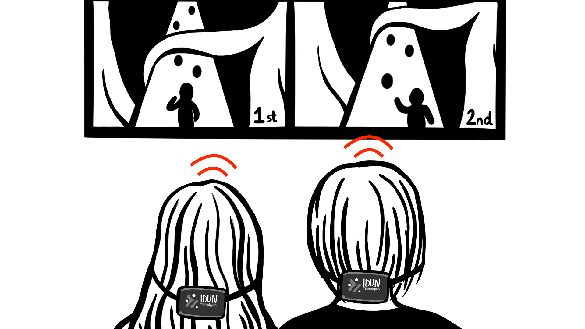

# Problem 3: Design and Marketing

## 🎯 Problem

In the final step, we would like to design a demo space for customers to present our neuro intelligence platform. The aim is to demonstrate the IDUN full-stack product. Consider the following:

- You have unlimited resources and can include any technology that you deem relevant to highlight the product
- You don't need to restrict yourself

## ✅ Tasks

- [x] Sketch the demo space graphically
- [x] What do you think are important factors that would highly attract customers in highlighting the hardware and software?

## 1. Demo Space

I would set up a digital demo room with the results of a BCI/IDUN DRYODE Guardian Hackathon: developers/engineers/tinkers with a wide range of skills and experience create different applicable products using the IDUN BCI, Brain API and/or IDUN software stack. These people compete against each other, and the most innovative technologies and ideas are chosen as winners. The winner-ideas will be presented on the Neurointelligence platform as live demo products.

The idea for my Bachelor project could be a possible result of such a hackathon: Mind Racing, a web-based 3D racing game that you can control only with your thoughts. Users can compete with each other via the Mind Racing website and race against users worldwide in real-time. The goal is to steer a 3D figure through a path with obstacles (similar to TempleRun). If you bump into an obstacle, you lose speed. There is also a public leaderboard with the highest scores and other gamification factors.

This demo product is an example that perfectly demonstrates a potential use case for the gaming industry and web accessibility. It is also a practical and fun way to illustrate the Internet of Humans, where we can connect each other's brains to achieve goals (even if as simple as playing a game). When marketed as a sub-brand of IDUN as "one of the demos on our neurointelligence platform", it will be one of the possible – even award-winning – demo products that will attract customers, potential clients, investors, and fans (I compare this idea to the growing game developer traction inside Tesla cars e.g.).

**Additionally:** To make these demo products more accessible, I would create walkthroughs and an on-site demo room with provided Guardian BCIs for visitors (like the VR room or demo space in the SAE Institute). E.g., a fully connected smart home (lights, fans, smart mirror, etc.) that adapts to the user's mental state and control.

---

## 2. Attract Customers

**Q:** What do you think are important factors that would highly attract customers in highlighting the hardware and software?

**A:** The Internet of Humans is a moonshot project that needs newly invented technology to reach major milestones – and that is precisely how I would market IDUN. Even though IDUN is a startup, I think it is important to show that we are a very competent team with different experts in this new, innovative, and very interdisciplinary field. We need to exhibit the full range of expertise from the team and the product.

Another factor is to show a clear product vision: What can it be used for? How will it impact the world in the next three years? What differentiates IDUN from others? And what differentiates BCIs from other technologies?

Last but not least, we have to show that BCIs are coming – it is an inevitable field of technology that will connect many different and essential areas (like the WWW did); here is where I see the importance of concise communication in terms of security and privacy. We won't just watch how the innovation happens with the downsides like neurohacking, or brain-data fingerprinting. In contrast, we will be the first to address these sensitive issues publicly (panels, articles, conferences, live streams etc.).

**To summarise:**

- Show the product and, more importantly, what it can do to change one's life.
- Always talk about privacy and security in the growing (and sometimes scary-sounding) field of neurotechnology.
- And don't forget the most critical asset: the team, our interdisciplinary experts in neuroscience, hardware, machine learning, software, security etc. We are doing our best to achieve craftsmanship in what we do to make the earth a better place.

**Ideas dump:**

- Create a conference about neurorights and neuro-privacy.
- Create a panel about the future of neurotechnology (can be a Meetup e.g.).
- Write articles about various things: philosophy, privacy, technological innovation etc.
- Create open-source tools for the neurotech community.
- Bridge the gap between academia and the industry via live streams and guest podcasts.
- Create a hackathon with your BCI to market the product in terms of applicable ideas and make yourself a name in the engineering community (like the ImpactHub in Zürich).
- Show progress about the neurointelligence platform, the brain API, the Guardian etc. publicly via showreels, videos, articles, live streams etc.
- Engage the employees to become brand ambassadors in their fields (e.g. create a Medium publication and let them write about the product, the company, their ideas etc.).

**Inspirations:**

- <https://x.company>
- <https://openai.com>
- <https://deepmind.com>
- <https://www.unrealengine.com>
- <https://www.spacex.com/vehicles/starship>
